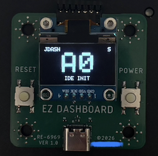
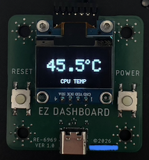
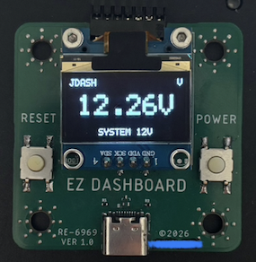
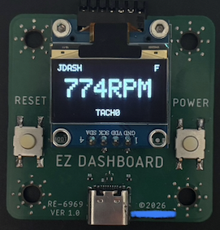

# N-in-One Enhanced ReDashboard - Open-Source "EZ Dashboard" Based on the RP2040 MCU

English | [简体中文](./README.zh-CN.md)

<table>
  <tr>
    <td></td>
    <td></td>
  </tr>
  <tr>
    <td></td>
    <td></td>
  </tr>
</table>

### Motherboard Support:

**Supports POST code monitoring through the following headers/interfaces:**

* JDASH1

* JDP1

* JBD1

* Any other UART header using 115200-8N1

**On MSI motherboards, connecting to "JDASH1" provides:**

* Display and logging of POST codes (Port80/81, 8-bit)

* Fan speed display

* System temperature display

* System voltage display

**On MSI motherboards, connecting to "JDP1" provides:**

* Display and logging of POST codes (Port80, 32-bit; Port81-83, 8-bit)

**On other motherboards, connecting to any header that outputs codes over UART 115200-8N1 provides:**

* Display and logging of POST codes (Port80, 8-bit)

**On all motherboards, additional connections to JBAT and JFP1 allow control of:**

* BIOS reset and system power on/off

### Firmware Features:

Code history:\
Supports caching P80 codes in the chip's internal memory.\
The onboard buttons can be used to scroll up and down through the recorded codes.

Code output:\
When connected via USB-C, the device operates as a USB CDC UART device.\
Supports decoded P80 code output.\
A future SDK will support voltage, temperature, and fan-speed logging.

Temperature / voltage / fan-speed sensors:\
Supports custom labels based on motherboard model.\
Supports Celsius / Fahrenheit temperature conversion.

OLED page control:\
Supports disabling unused pages, such as hiding the voltage page.\
Supports automatically returning to the home page after N seconds.\
Supports automatically waking the display when a significant change in temperature, voltage, or fan speed is detected.\
Supports automatically displaying updated POST codes.

OLED burn-in protection features:\
Pixel shifting.\
Automatic dimming.\
Automatic page-title hiding.\
Automatic display shutoff.

### Button Controls:

Short-press both side buttons -> Switch input source (JDASH/UART).\
Hold both side buttons for 3 seconds -> Switch button mode (page navigation mode / power-button mode).\
Hold both side buttons for 5 seconds -> Lock the JDASH/UART input and lock the buttons\
(buttons have no function while locked, Hold again to unlock).\
Hold both side buttons for 10 seconds -> Reset BIOS (NMOS connects JBAT1).

Press either side button 5 times consecutively -> Change page (switch display page).\
On the P80 page, hold either side button -> Scroll up/down through the P80 code history.

### BOM + Manufacturing Notes:
**If you want to reproduce the design directly, please note that the design was imported into JLCPCB/LCEDA from an external source.**\
**I cannot confirm whether Gerber files exported from this project can be used directly for PCB manufacturing.**\
**Please verify the schematic, PCB routing, and copper pours yourself.**\
**Using the Autodesk Eagle design files to generate gerber should be fine**

The reproduction cost is only about RMB 15:\
RMB 6 for a 0.96-inch, 4-pin I2C OLED module.\
RMB 5 for an RP2040 module, from which the RP2040, crystal oscillator, and SPI NOR flash are removed.\
RMB 4 for other capacitors, resistors, LDOs, and miscellaneous components.\
RMB 0 for a free 2-layer PCB (thanks to JLCPCB).

**Note:**\
Reproducing the RP2040 version of ReDashboard is not recommended here.\
A later version will use a PY32 as the main controller, reducing the chip cost significantly to about RMB 0.5, and requiring almost no external components.\
The firmware has already been written and successfully tested. It will be updated when I'm free.\
<br>

### Firmware and Firmware Source Code:
You can use the precompiled `firmware.uf2` file, but it is recommended that you modify the configuration and compile the firmware yourself.
<br>

### License:
Both the hardware and firmware of this project are licensed under the GPL (v3 or later).\
I provide no guarantees regarding the functionality or safety of this project.\
You are free to use, sell, and create products based on this project.

```
/*
 * This file is part of the "ReDashboard_V2" distribution.
 *
 * Copyright (C) 2026 @himko9 <me@himko.dev>
 * Github: https://github.com/himko9/ReDashboard_V2
 *
 * This program is free software: you can redistribute it and/or modify
 * it under the terms of the GNU General Public License as published by
 * the Free Software Foundation, either version 3 of the License, or
 * (at your option) any later version.
 *
 * This program is distributed in the hope that it will be useful,
 * but WITHOUT ANY WARRANTY; without even the implied warranty of
 * MERCHANTABILITY or FITNESS FOR A PARTICULAR PURPOSE.  See the
 * GNU General Public License for more details.
 *
 * You should have received a copy of the GNU General Public License
 * along with this program.  If not, see <https://www.gnu.org/licenses/>.
 */
 ```
